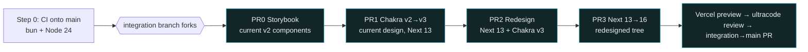

# Plan — Redesign-First + Chakra v3 / Dependency Migration for tylerpweb.dev

## Context

`tylerpweb.dev` is a single-page portfolio **in production** (Next 13.4.5 Pages Router, Chakra UI 2.7, React 18.2, 13 i18n locales via next-i18next + Crowdin). Tyler wants three large changes. They were originally sequenced deps-first; the sequence is now **redesign-first**: (1) migrate **Chakra UI v2→v3**, (2) **redesign** to the approved Claude Code Design ("Website redesign proposal"), (3) update deps incl. **Next 13→16 last**.

**Sequencing rationale (verified against current docs, not memory):** the redesign is authored against Chakra v3 (its token map is in `createSystem`'s `{ value: … }` shape), so it genuinely depends on the Chakra migration. But **Chakra v3 does _not_ depend on Next 16** — v3 needs React `>=18` (have 18.2 ✓), Emotion 11 (have 11.11 ✓), and is not locked to any Next major (and the one Next-coupled Chakra package, `@chakra-ui/next-js`, is dropped anyway). So Chakra v3 migrates cleanly on the **existing Next 13.4.5 stack**, the redesign builds on v3 without waiting for the Next upgrade, and **Next 13→16 decouples to the final PR**. Trade-off accepted: the redesign ships on Next 13 until PR3, so the remote's reported vulns aren't cleared until the Next bump lands last (see Step 0 §6).

Two realities verified against the tree still drive the approach:

- **There is no CI.** No `.github/` at all; the only gate is a local, bypassable Husky `next lint` pre-commit hook. A production redesign can't be gated safely until CI exists — so CI is built first, onto `main`.
- **The Chakra v3 break surface is contained but not trivial.** Zero usage of the loud deprecations (`colorScheme`/`leftIcon`/`useToast`/`is*` — grep-confirmed clean). The real work is: the theme system (`extendBaseTheme`→`createSystem`), the **`spacing`→`gap` rename on 18 Stack call-sites** (5 of them pass the custom `space.text.*` tokens), the `space.text.*` scale + `Heading`/`Button` recipes + `Tabs`/`Tooltip` slot themes, 13 `createIcon` icons, and the single dropped `@chakra-ui/next-js` `<Image>`.

Intended outcome: ship the redesigned Chakra-v3 / Next-16 site to production as **one reviewed, preview-verified merge**, with each risky change isolated on its own PR so any regression is bisectable.

Decisions already made by Tyler: keep all 13 languages · stay on Pages Router · Storybook first · React stays 18.2 · **switch package manager yarn→bun** · **pin Node 24 LTS** · **redesign-first ordering** · three sequential PRs into an integration branch. Library facts below were pulled from current docs (Context7 / claude-code-guide), not memory.

---

## Verified current-state inventory

| Fact | Evidence |
|---|---|
| No CI, no `.github/`, no `.claude/`, no `.mcp.json`, no `.nvmrc` | all absent on disk |
| Husky pre-commit = `yarn lint` only; scripts use `yarn`; `yarn.lock` present | `.husky/pre-commit`, `package.json` |
| `theme.ts` uses `extendBaseTheme`, imports `theme` from `@chakra-ui/react`, spreads `theme.components.Button.baseStyle`/`.sizes.lg`, and re-exports `theme.components.Tooltip`/`.Tabs` verbatim | `src/lib/theme.ts:1,93-94,124-125` |
| Custom `space.text.{sm..4xl}` scale + `fontSizes`/`lineHeights` scale | `src/lib/theme.ts:38-64` |
| Fonts injected as CSS vars `--font-tw`/`--font-mulish` via `<style jsx global>`, referenced in theme as `var(--font-tw)` | `src/pages/_app.tsx:9-27`, `theme.ts:34-36` |
| `<ChakraProvider theme={theme}>` in `_app.tsx` | `src/pages/_app.tsx:30` |
| `spacing` prop used **18×** on Stack/VStack/HStack; **5** pass `spacing="text.*"` | `HeroSection`, `AboutMeSection`, `ReachOutSection`, `ProjectsSection/*`, `pages/index.tsx` |
| `@chakra-ui/next-js` `<Image>` — **1 usage** | `src/components/ProjectsSection/ProjectItemCard.tsx:1` |
| `framer-motion`, `@emotion/styled` — **0** `src/` imports | grep clean → safe to drop |
| 13 `createIcon` icons (incl. `CurvedDownArrow`) | `src/lib/icons/*.tsx` |
| Sections: Hero → About → (Skills + Projects in `MainSection`) → ReachOut | `src/pages/index.tsx:26-41` |
| 13 locales, 3 namespaces (`common`, `projects-item-data`, `open-source-data`) | `public/locales/*` |
| `.vscode/mcp.json` = chakra-ui, react-icons, next-devtools, crowdin (token via `${input:crowdin-token}`) | `.vscode/mcp.json` |
| Crowdin wired via bare `crowdin.yml` (source→translation mapping only, **no `project_id`/auth in file**); no `@crowdin/cli` dep, no `crowdin` script, no CI step — **no in-project way to test it today** | `crowdin.yml`, `package.json` (absent) |

**Version-compat facts (verified via Context7, July 2026):**

| Constraint | Requirement | Current stack | Status |
|---|---|---|---|
| Chakra v3 React peer | `react >=18` (supports 18 **and** 19; not locked to 19) | 18.2.0 | ✅ |
| Chakra v3 Emotion | Emotion 11 (`@emotion/react@latest` stays v11) | 11.11.1 | ✅ |
| Chakra v3 vs Next | Not locked to a Next major, given supported React + Emotion | Next 13.4.5 | ✅ (v3 is Next-agnostic) |
| Chakra v3 CLI (`chakra typegen`) | **Node ≥ 20.6.0** | pin **Node 24 LTS** | ✅ |
| Next 13.4.5 | Node ≥ 16.14.0, React ≥ 18.2 | 18.2.0 | ✅ |
| Next 16 | **Node ≥ 20.9.0**, React 18.2 **or** 19, **TS ≥ 5.1.0** | TS 5.1.3 | ✅ |
| Node "latest" | Node 26 = *Current* (not LTS until Oct 2026); **Node 24 = Active LTS** → Apr 2028; Node 22 = Maintenance LTS → Apr 2027 | pin **24** | ✅ latest LTS |

**Node decision:** pin **Node 24 (Active LTS)** — *not* Node 26 (Current/bleeding-edge, untested against Next 13.4.5). Node 24 clears every floor in one pin for the whole sequence (Chakra CLI 20.6, Next 16 20.9), and is the recommended LTS line for new projects. Step 0's baseline CI run on the current Next 13.4.5 tree is the proof that Next 13 builds on Node 24 before any migration; fallback is Node 22 for PR0–PR2, bumping to 24 at PR3, if the baseline surfaces a hard break (realistic risk is only deprecation-warning noise, e.g. `punycode`).

**Latent risk to resolve in Step 0:** the `theme` script runs `chakra-cli tokens src/lib/theme.ts`, but the installed CLI (`@chakra-ui/cli`) ships the `chakra` binary. Confirm `bun run theme` actually runs on the current tree *before* wiring it into CI — if it's already broken, the v2 baseline can't go green until the script is fixed (or the codegen step is deferred to PR1 where it becomes `chakra typegen`).

---

## Branch strategy (production-safe)

```
main (production, protected — CI required after Step 0)
 │
 ├─ ci/foundation ─────────────► main          (Step 0: small, safe, FIRST)
 │
 └─ redesign/next16-chakra-v3   ◄─── long-lived INTEGRATION branch
        │   (all feature branches merge HERE, never into main)
        ├─ chore/storybook-setup   ─► integration   PR0
        ├─ refactor/chakra-v3       ─► integration   PR1   (Chakra v2→v3, on Next 13)
        ├─ feat/redesign            ─► integration   PR2   (redesign, Next 13 + Chakra v3)
        └─ chore/next16-upgrade     ─► integration   PR3   (Next 13→16, redesigned tree)
        │
        └─ redesign/next16-chakra-v3 ─► main   single final PR (after all gates + Vercel preview)
```

`main` stays continuously deployable; the new site ships as one reviewed merge with a preview to eyeball.

---

## Step 0 — Establish CI (net-new, onto `main` first)

**Effort: run `/effort` → `low`–`medium`** (config authoring, build-verified). Must land **before** the integration branch forks so every later PR and the final promotion are gated. The **yarn→bun switch happens here** so CI is bun-native from the first green run, and **Node 24 is pinned here** so the Chakra v3 CLI (`chakra typegen`, needs ≥20.6.0) works from PR1 onward.

1. **Migrate yarn→bun** (approval-gated dep/tooling change): `bun install` to generate `bun.lock`; delete `yarn.lock`; update `.husky/pre-commit` `yarn lint`→`bun run lint`; update `CLAUDE.md` Commands block (`yarn dev/build/lint/theme` → `bun run …`); add `"packageManager": "bun@<version>"` to `package.json`. Verify `bun run dev`/`build`/`lint`/`theme` all work locally before committing.
2. Add `package.json` script `"typecheck": "tsc --noEmit"` (tsconfig is already `strict` + `noEmit`; nothing invokes it today).
3. Reconcile the theme codegen script (see latent risk above) so `bun run theme` runs clean on the v2 tree.
4. **`.github/workflows/ci.yml`**:
   - `on: pull_request` **and** `push` for `[main, redesign/next16-chakra-v3]` — the branch filter must include the integration branch or PRs into it run nothing.
   - Single `ubuntu-latest` job, **Bun** via `oven-sh/setup-bun` (pin a version) running on a **Node 24** runtime (`actions/setup-node@node-version: 24`, so the `chakra typegen` step has Node ≥20.6.0): `bun install --frozen-lockfile` → `bun run theme` → `bun run lint` → `bun run typecheck` → `bun run build`. (`--frozen-lockfile` reads `bun.lock`, so it must be committed.)
5. **`.nvmrc` (`24`)** + `engines.node` `">=20.9.0"` in `package.json` (floor, not a hard-pin, so Vercel/contributors aren't over-constrained while `.nvmrc` selects 24 locally/CI). Node 24 is the latest LTS and satisfies Chakra v3 CLI (≥20.6.0) and Next 16 (≥20.9.0).
6. Recommended now: **`.github/dependabot.yml`** — Dependabot doesn't support the bun ecosystem for lockfile updates; scope it to `github-actions` (weekly) for now and track app-dep bumps through the PRs. **Note the redesign-first trade-off:** the remote reports 65 vulns, and these are cleared by **PR3's** Next upgrade — which now lands *last*, so those vulns persist through PR1/PR2 (the redesign ships on Next 13 until then). Accepted; flag at the final gate.
7. Get CI **green on the current v2 codebase** (baseline) before any migration — proves the gate, captures a known-good start, **and confirms Next 13.4.5 builds on Node 24** (the Node-bump validation).
8. **Branch protection is a GitHub-settings action Tyler must do** (require the CI check on `main` and the integration branch). Flag explicitly — not doable in-repo.

Storybook build / a11y / visual-regression steps are added to `ci.yml` **incrementally** as they land (PR0/PR2), not up front.

Verify: push a throwaway branch → confirm the workflow installs with bun on Node 24, runs `lint`/`typecheck`/`build`, and passes on the current tree.

---

## Build sequence



Each arrow is a CI-green gate. No two risky changes ride the same PR.

**How to read the effort / orchestration tags (explicit — do not treat as slash commands to type).** The `/low`, `/medium`, `/high`, and `/ultracode` markers below are shorthand. Resolve each one *explicitly* before starting the phase:

- **`/low` · `/medium` · `/high`** → **set the session effort level to that tier by running the `/effort` command** (the same command Tyler uses to set his default). These name an effort *tier*, not a literal command — there is no `/high` command; `/effort` is the command. Switch at the phase boundary; if a single step carries its own tier, switch for that step and drop back after. When a phase mixes tiers, default to the **lower** one.
- **`/ultracode` is NOT an effort tier.** It means: **run this step as a multi-agent Workflow** (fan-out orchestration via the Workflow tool). Per the Workflow opt-in rules the executor **must not self-launch it** — it requires Tyler's explicit `ultracode` opt-in *each time* (the keyword in his prompt, or the session ultracode toggle on). At every `/ultracode` step: **stop, describe the fan-out you would run and its rough token cost, and ask Tyler to opt in.** If he declines, fall back to single-agent at `/high` effort.

**PR0 — Storybook safety net** — **`/effort` → `low`** (scaffold + config, build-verified) (into integration first). Stand up Storybook on the *current* components so every section is visually diff-able through PR1/PR2. Confirm `next/font` + path aliases (`@/components`, `@/data`, `@/svg-icons`) resolve. Add a Storybook build step to `ci.yml`.

**PR1 — Chakra v2→v3** — **`/effort` → `medium`** for the mechanical steps (1–3, 6–8), **raise `/effort` → `high` for the `theme.ts`→`createSystem` rewrite (step 4)** where recipe/slot API shape and token porting need judgment; drop back to `medium` after (Pages Router, current design, **still Next 13.4.5**) — use the official **`chakra-ui-migrate`** skill + `@chakra-ui/react-mcp` over freehand:
1. `@chakra-ui/react@latest` + `@emotion/react@latest`; **remove** `@chakra-ui/next-js`, `@emotion/styled`, `framer-motion`, old `@chakra-ui/cli` (all confirmed unused in `src/` or superseded). New `@chakra-ui/cli` provides `chakra typegen` (needs Node ≥20.6.0 — satisfied by the Step 0 Node 24 pin).
2. `npx @chakra-ui/codemod upgrade` — this renames the **18 `spacing`→`gap`** call-sites; hand-verify the **5 `spacing="text.*"` → `gap="text.*"`** cases still resolve against the ported token scale.
3. Generate v3 provider → `src/components/ui/provider.tsx`; swap `_app.tsx` to `<Provider>` with `value=` (not `theme=`).
4. **(`/effort` → `high`)** Rewrite `src/lib/theme.ts` → `createSystem(defaultConfig, …)`: port `space.text.*`, `fontSizes`, `lineHeights` into the v3 `{ value: … }` token shape; convert `Heading`/`Button` `baseStyle`/`variants` to **recipes**; convert `Tabs`/`Tooltip` (currently passthrough of `theme.components.*`, which no longer exists in v3) to **slot recipes** — do not spread a v2 default that's gone.
5. Preserve the `--font-tw`/`--font-mulish` CSS-var pattern (don't inline font families into the theme).
6. Verify the 13 `createIcon` icons render under v3; `<Icon asChild>` fallback if any API shifts.
7. Replace the one `@chakra-ui/next-js` `<Image>` in `ProjectItemCard.tsx` with `next/image` (available in Next 13.4) styled via Chakra (or `<Image asChild>`).
8. Update the `theme` script → `chakra typegen`; update `package.json`, `ci.yml`, `CLAUDE.md` (path-alias + theme-command notes).
9. **(Workflow — requires Tyler's `ultracode` opt-in; ask before launching)** Verify every section in Storybook + app via a **fan-out review** — one agent per section (Hero, About, Skills, Work/Projects, Contact, Header-less current tree) checking v3-token resolution, `gap` correctness, recipe/slot output, and Storybook visual diff, then an adversarial verify pass on any flagged regression. Efficient here because the 6 sections are independent and the check is identical per section. **Gate.**

**PR2 — Redesign** — **`/effort` → `high`** for design work; the parallelizable build and sweep run as **multi-agent Workflows (each requires Tyler's `ultracode` opt-in — ask first)** (on **Next 13 + Chakra v3** — Next 16 comes *after*):
1. **(`/effort` → `high`)** Resolve the open design gaps below (mobile layouts, real assets, contrast) — judgment-heavy, do sequentially.
2. **(Workflow — requires Tyler's `ultracode` opt-in; ask before launching)** Build sections to the new design as a **fan-out, one section per agent behind Storybook** — `Header.tsx` (NEW sticky nav) · Hero (branch-graph SVG) · About · Skills (commit-rail SVG) · Work (`ProjectsSection`, tab toggle) · `ContactSection.tsx` (rename of `ReachOutSection`, links only). Shared scaffolding first (`MainSection` band wrapper, `SocialLinksList`, `src/components/ui/provider.tsx`, token map applied to theme) so agents build against a stable base; use worktree isolation since sections are built in parallel. Efficient because each section is an independent unit against a fixed design + token map. Fonts added via `next/font/google` (available in Next 13.4) as CSS vars — extend the existing `--font-*` pattern with `--font-mono`.
3. Re-string all copy as `t()` keys; update `public/locales/en/*`; verify against the **reviewed Crowdin setup** (run `crowdin status`/MCP query first to confirm sources + languages), then re-sync Crowdin (approval-gated).
4. **(Workflow — requires Tyler's `ultracode` opt-in; ask before launching)** Verify responsive + a11y + i18n as a **fan-out sweep** — parallel agents over {breakpoints × sections} for layout/contrast and over the 13 locales for `t()` key coverage, with an adversarial verify pass on flagged contrast/AA failures. **Gate.**

**PR3 — Deps + Next 13→16** — **`/effort` → `medium`** (codemod-driven, mechanical; raise `/effort` → `high` only if the codemod leaves manual config conflicts) (Pages Router, **redesigned Chakra-v3 tree**):
1. `npx @next/codemod@canary upgrade latest`.
2. Bump `next`, `eslint-config-next`, `@types/*`; **keep React 18.2** (Next 16 supports 18.2 or 19). Node 24 already pinned (Next 16 needs ≥20.9.0); TS 5.1.3 already clears Next 16's ≥5.1.0.
3. Check `next-seo@6` compat with Next 16 (still consumed in `_app.tsx`).
4. Re-verify the redesign + Chakra v3 render **unchanged** after the upgrade — the codemod touches Next internals (`next/image`, `next/font`, config), not Chakra, but confirm the redesigned sections and the swapped `<Image>` still render. Storybook visual-diff the sections against their PR2 baseline.
5. **This is where the 65 vulns clear** (Next bump) — confirm the count drops. `bun run build` + run app. **Gate → final.**

### Token map (design → Chakra v3 `createSystem`)

**Source of truth (DECIDED):** tokens are built **only** from `DesignSystem.dc.html` inside the "Website redesign proposal" Claude Design project (`3888fdd5-74ed-4b01-9f59-d3c985e1ddde`). **Do not reference any other Claude Design project** — the standalone "Personal website design system" project is explicitly out of scope and must not be consulted for token values, even if it appears to overlap. The layout is `Portfolio.dc.html` in the same project.

Canvas `#0b1617`→`bg.canvas` · Surface `#0f1e20`→`bg.surface` · Band `#122527`→`bg.band` · Teal `#33a6c0`→`accent.solid`/`primary` · Teal-bright `#56c4da`→`accent.emphasis`/link · Amber `#f2b544`→`warm.solid` · Ink `#eaf3f2`→`fg.default` · Muted `#a3b5b4`→`fg.muted` · Line `#56c4da24`→`border.subtle`. Fonts (Titillium Web / Mulish / **JetBrains Mono**) added via `next/font/google` in `_app.tsx` as CSS vars (extend the existing pattern with `--font-mono`), referenced from `theme.tokens.fonts`.

---

## Where we can push without a PR

Distinction is *what changes*, not which branch — and only **after Step 0** (no gate exists before then, so hold even low-risk pushes to meta/docs on the current tree).

| Push directly (integration/working branch) | Requires a PR (CI-gated) |
|---|---|
| Docs/meta the built site can't consume: `PLAN.md`, `.claude/rules/*`, `.mcp.json`, `.nvmrc`, `.github/dependabot.yml`, editor configs, `CLAUDE.md` | Anything under `src/`, `public/locales/`, `theme.ts`; `package.json` deps + `bun.lock`; `.github/workflows/*`, `next.config.js`, `tsconfig.json` |
| | **Into `main`: always PR + Tyler approval** |

## Automation vs. approval

| Safe to automate (no approval needed) | Requires Tyler's approval |
|---|---|
| Codemods (`@chakra-ui/codemod`, `@next/codemod`), build/lint/typecheck runs, inventory/grep, icon-compat checks, Storybook scaffold + stories, i18n **key extraction** (mechanical), per-section redesign behind Storybook, CI/config YAML authoring, ultracode fan-out reviews | **Any merge to `main`** · **adding/removing/upgrading dependencies** (incl. the **yarn→bun switch**) · semantic **token naming** in `theme.ts` · **Crowdin re-sync / deleting locales** · copy/content changes · final visual sign-off · force-pushes/history rewrites |

Rule: **inward, reversible, verifiable → automate. Outward-facing / production / design judgment → approve first.**

### Approval checkpoints (incremental, in build order)

The executor runs automated work freely between these points but **must stop and get Tyler's explicit approval at each**, in sequence:

1. **Before Step 0's yarn→bun switch** — package-manager change touches lockfile + every script (dep-tooling change). (The Node 24 pin rides along here.)
2. **Before each dependency add/remove/upgrade:**
   - **PR1** — Chakra swap (`@chakra-ui/react@latest`, `@emotion/react@latest`) + the 4 removals (`@chakra-ui/next-js`, `@emotion/styled`, `framer-motion`, old `@chakra-ui/cli`).
   - **PR3** — Next/deps bumps (`next`, `eslint-config-next`, `@types/*`).
3. **On `theme.ts` semantic token naming** (PR1 step 4 / PR2 token map) — Tyler owns design/architecture naming.
4. **Before any Crowdin re-sync or locale change** (PR2 step 3) — external, published.
5. **Before merging any PR into the integration branch** — after CI green, a `code-review` of the diff, then Tyler's go.
6. **Redesign copy/content + final visual sign-off** (PR2).
7. **The single integration→`main` PR** — production; always PR + approval, after the multi-agent Workflow review (Tyler's `ultracode` opt-in) and Vercel preview.

Each `.claude/rules/*` file (below) encodes the matching gate so the constraint fires automatically when the relevant paths are touched, not just from this list.

## Effort-mode routing (switch directives)

These are the mode-switch points, consolidated. **Resolve each tag per the legend under "Build sequence":** `/low` / `/medium` / `/high` = **run `/effort` to set that session effort tier**; `/ultracode` = **run as a multi-agent Workflow, which requires Tyler's explicit `ultracode` opt-in first — not an effort tier and never self-launched.** Switch **at the phase boundary** and, for a step flagged with its own tier, switch for that step and drop back after. Default to the lower tier when a phase is mixed.

| Phase / step | Action | Why |
|---|---|---|
| Step 0 (CI, yarn→bun, Node 24 pin, dependabot) | `/effort` → `low`–`medium` | Config authoring, build-verified |
| PR0 Storybook scaffold | `/effort` → `low` | Mechanical scaffold + stories |
| Crowdin setup review (MCP verification + `crowdin.yml` audit) | `/effort` → `low` | Read-only project query + config check |
| PR1 steps 1–3, 6–8 (install, codemods, provider, icons, script/docs) | `/effort` → `medium` | Mechanical migration |
| **PR1 step 4** (`theme.ts`→`createSystem`, recipe/slot port) | **`/effort` → `high`** | v3 API shape + token porting need judgment |
| **PR1 step 9** (per-section v3-correctness + visual-diff verify) | **Workflow — needs `ultracode` opt-in** | 6 independent sections, identical check → efficient fan-out + adversarial verify |
| PR2 step 1 (design-gap resolution) | **`/effort` → `high`** | Judgment-heavy, sequential |
| **PR2 step 2** (per-section redesign build behind Storybook) | **Workflow — needs `ultracode` opt-in** | Independent sections against a fixed design/token map → parallel build (worktree-isolated) |
| **PR2 step 4** (responsive + a11y + i18n sweep) | **Workflow — needs `ultracode` opt-in** | Fan-out over {breakpoints × sections} and 13 locales + adversarial contrast/AA verify |
| PR3 deps + Next codemod; i18n key extraction | `/effort` → `medium` | Codemod-driven, build-verified (raise to `high` only on manual config conflicts) |
| Pre-production cross-cutting review before integration→`main` | **Workflow — needs `ultracode` opt-in** | Multi-agent adversarial verification at the production gate (v3 correctness + a11y/contrast + visual regression over the whole diff) |

---

## Project config to initialize (safe, project-local — after approval)

**`.mcp.json`** (project root — Claude Code ignores `.vscode/mcp.json`), mirroring the 4 servers already in `.vscode/mcp.json`: `@chakra-ui/react-mcp`, `react-icons-mcp`, `next-devtools-mcp`, `crowdin` (http; token via `${CROWDIN_TOKEN}` env, translating the VS Code `${input:...}` form).

### Crowdin setup review (do early — before PR2 relies on it) — **`/effort` → `low`**

The site's 13-locale sync runs through `crowdin.yml`, which is currently just a file mapping with no `project_id` or auth in-file, and there is **no in-project way to test it**. Now that the Crowdin MCP server is available, review and establish a test path:

1. **Confirm `.mcp.json` crowdin server connects** — provide `CROWDIN_TOKEN`, then via the MCP query the live project to verify: (a) the project's target languages exactly match the 13 in `next-i18next.config.js`; (b) all three source namespaces (`common.json`, `projects-item-data.json`, `open-source-data.json`) are registered as sources; (c) the file mapping (`%two_letters_code%/%original_file_name%`) resolves to the real `public/locales/<lang>/` paths; (d) current translation progress per language. This is read-only — the primary "test" with no new dependency.
2. **Audit `crowdin.yml` for up-to-date correctness**: `%two_letters_code%` is valid for the current all-two-letter locale set; confirm no `preserve_hierarchy`/`base_path` drift, and decide whether auth stays via the Crowdin **GitHub app integration** (recommended — no secrets in repo) or moves to CLI env vars.
3. **Optional CI-testable path (approval-gated dep add):** add `@crowdin/cli` as a devDep + a `"crowdin:status"` script (`crowdin status`) and reference `${CROWDIN_PROJECT_ID}`/`${CROWDIN_PERSONAL_TOKEN}` env in `crowdin.yml`; this makes `crowdin config`/`crowdin status` a runnable dry-run locally and (with a secret) an optional CI check. Recommend adding it so PR2's re-sync is verifiable before it touches the published project.

Route: read-only MCP verification needs no approval; the `@crowdin/cli` add and any actual upload/re-sync are **approval-gated** (external, published).

**`./.claude/rules/*.md`** (auto-load; `paths:` frontmatter scopes a rule):

| File | `paths:` | Enforces |
|---|---|---|
| `branch-safety.md` | (always) | Production; PRs target integration, never `main` directly; only meta/docs push direct |
| `dependencies.md` | (always) | Dep add/remove needs approval; don't reintroduce dropped deps (`@chakra-ui/next-js`, `@emotion/styled`, `framer-motion`) |
| `chakra-v3.md` | `src/lib/theme.ts`, `src/components/**`, `src/lib/icons/**` | `createSystem` not `extendTheme`/`extendBaseTheme`; `<Provider value=>`; `gap` not `spacing`; `createIcon`/`<Icon asChild>`; run `chakra typegen` after theme edits |
| `i18n.md` | `src/components/**`, `public/locales/**` | Every user-facing string is a `t()` key; update `en` source; Crowdin sync is approval-gated |
| `components.md` | `**/*.{tsx,jsx}` | Story-first (`storybook:stories` before any component change) |
| `git-safety.md` | (always) | Never commit/push/merge to the protected default branch (`main`) or force-push without explicit approval |

All six live in the project's `./.claude/rules/` and ship with the repo — none are written to `~/.claude/` (nothing touches other projects or needs cross-project approval).

**Official skills to adopt:** Chakra `chakra-ui-migrate` (PR1); in-session `storybook:*`, `frontend-design`, `verify`/`run`, `code-review`/`simplify`/`security-review`.

---

## Open design gaps (accepted, resolve before PR2)

1. **Mobile/responsive** — hero is a desktop row; nav has no mobile menu. **(Tyler updating in Claude Design now.)**
2. **Project assets — NOT a gap; reuse what exists.** The design's placeholders map 1:1 to existing repo assets — wire the redesign to them, don't source anything new:
   - Screenshots: all 5 in `public/images/projects/*-preview.png` (referenced by `projectsData[].image`).
   - Demo URLs: real, per-project in `projectsData[].demoUrl`.
   - Source URLs: per-repo via `github.com/tylerapfledderer/${githubSlug}` (`ProjectItemCard.tsx:108`) — the design's generic-profile links are just placeholders.
   - OSS contribution/project URLs: real, in `openSourceData` (`ProjectsSection/utils.ts`).
   - Motif asset `public/static/version-control.svg` already exists.
   - (Confirms gap #4's weather issue is *only* the locale description string; its image/slug/demo are correct.)
3. **Contrast — measured (WCAG); DECIDED: target AA, relabel the claim (teal token unchanged):**
   - **Fix:** `#5f8384` sha/"node" labels (10–11px) = **4.44 → fails AA** → brighten to ≥4.5 (≈`#7a9ea0`).
   - **Relabel:** design-system copy claims "WCAG AAA (7:1)" but teal `#33a6c0` on canvas = 6.45 (and `#04191d`-on-teal button = 6.33) → change the stated promise to **AA**; **do not** brighten teal, so `accent.solid`/token map is unchanged.
   - Correction to earlier draft: `#7fb6c2` mono labels = **7.6–8.2, pass AAA** (not a problem). Ink/amber/muted/teal-bright link all pass AAA.
4. **Content drift — DECIDED: design copy wins.** Adopt the design's rewritten copy as the new `en` source across the 3 i18n namespaces (NOT `src/lib/data.ts`, which holds only social links; project/OSS structure lives in `ProjectsSection/utils.ts`), then re-translate all 13 locales from it:
   - **🐛 Fixes existing data bug:** `project-item-weatherapp-description` is currently a copy-paste of the Cloudflare login text; the design's correct weather copy replaces it.
   - Hero, About, and all 5 project descriptions are rewritten to the design's tighter copy → new `en` source strings.
   - **Translation churn:** because source strings change, the Crowdin re-sync in PR2 re-translates all 12 non-en locales (not just new keys) — larger than a keys-only sync; budget for it.
   - Preserve the `about-main-description` `<0>…</0>` Chakra-link interpolation as a `t()` with a component (don't hardcode the inline `<a>` the design shows).
5. **Skills set** — design's commit-rail hardcodes **11 skills** in order (HTML5→Next); confirm the set/order. The 13 icons cover them (+ `EthIcon` for OSS, `CurvedDownArrow` for UI).
6. **Token-map fidelity** — design uses ~5 muted body tints (`#a9bab9`, `#c3d2d1`, `#c6d5d4`, `#b8c9c8`); decide whether to tokenize a couple (`fg.muted` + `fg.subtle`) or collapse to one.

---

## Verification

- **Step 0:** throwaway branch → `ci.yml` installs with bun on **Node 24** and runs `lint`/`typecheck`/`build`, passing on the current v2 tree (this also confirms **Next 13.4.5 builds on Node 24**).
- **Crowdin:** MCP query returns the live project's 13 languages + 3 source namespaces matching the repo; `crowdin status` (if `@crowdin/cli` added) runs clean before any re-sync.
- **Each PR:** CI green + `verify`/`run` the app locally; visual-diff affected sections in Storybook; `code-review` the diff before merge to integration.
- **PR3 specifically:** confirm the redesign renders unchanged post-Next-16 (Storybook diff vs. PR2 baseline) **and** the 65 vulns clear.
- **Before `main`:** deploy a **Vercel preview** of the integration branch; run the cross-cutting review **as a multi-agent Workflow (requires Tyler's explicit `ultracode` opt-in — pause and ask first; not self-launched)** (v3 correctness, a11y/contrast vs. the **AA** target, responsive, i18n coverage across all 13 locales); Tyler's final visual sign-off; then the single integration→`main` PR.

---

## First deliverable after approval

Write this plan to repo `PLAN.md` (persistent build reference), create `.mcp.json` + the 6 project rule files, then open `ci/foundation` for Step 0 (starting with the yarn→bun switch, pinning Node 24, and confirming `bun run theme` + a full build run on the current tree under Node 24).
